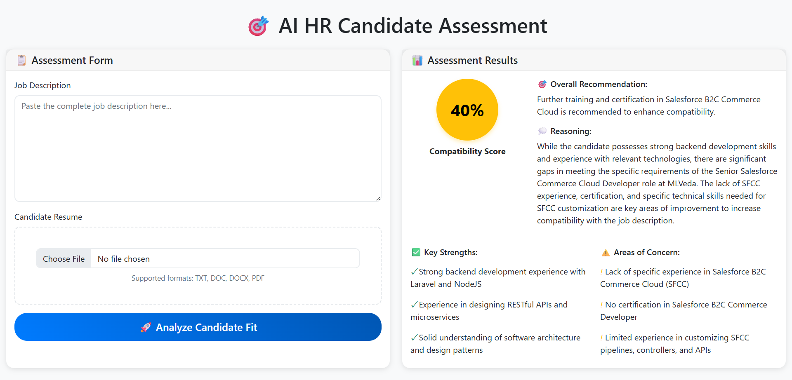
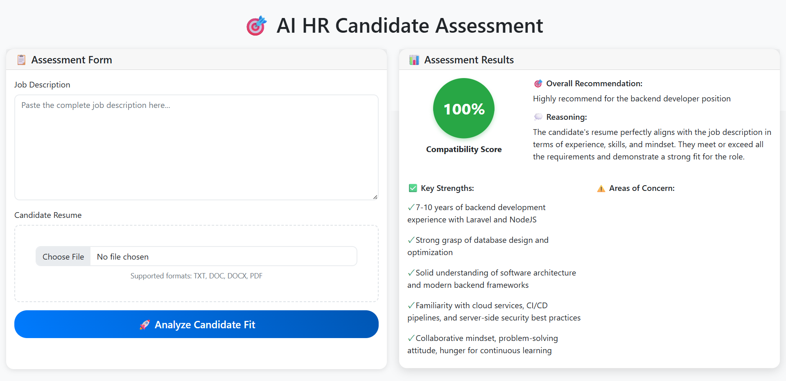

# 🧠 AI Resume Matcher

An AI-powered web application that helps HR professionals assess how well a candidate’s resume matches a specific job description.

## 🚀 Features

- Upload any **job description**
- Upload a **candidate's resume** (text or PDF)
- Get a real-time **compatibility score** generated by **OpenAI GPT model**
- Clean and simple **EJS-based frontend**
- Built with **Express.js** backend and integrated **OpenAI API**

## 📸 Screenshots




## 🛠 Tech Stack

- **Backend:** Node.js, Express.js  
- **Frontend:** EJS, HTML, CSS  
- **AI Integration:** OpenAI API (GPT model)  
- **File Handling:** Multer (for resume uploads)

## 📦 Installation

1. **Clone the repository**
   ```bash
   git clone https://github.com/yourusername/ai-resume-matcher.git
   cd ai-resume-matcher
